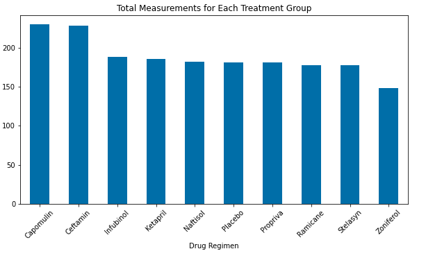
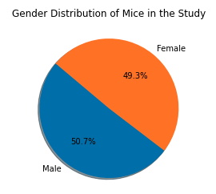

This repo includes code that takes data from a study of 249 mice identified with squamous cell carcinoma tumor growth. The code performs the following functions:

    Checks the data for duplicates and puts the unique rows into a cleaned dataframe.

    Generates a summary statistics table consisting of the mean, median, variance, standard deviation, and SEM of the tumor volume for each drug regimen.

    Generates a bar plot using both Pandas's DataFrame.plot() and Matplotlib's pyplot that shows the total number of measurements taken for each treatment regimen throughout the course of the study.

    Generates a pie plot using both Pandas's DataFrame.plot() and Matplotlib's pyplot that shows the distribution of female or male mice in the study.

    Calculates the final tumor volume of each mouse across four of the most promising treatment regimens. 

    Calculates the quartiles and IQR and quantitatively determines if there are any potential outliers across all four treatment regimens.

    Generates a box and whisker plot of the final tumor volume for all four treatment regimens and highlights any potential outliers in the plot by changing their color and style.

    Generates a line plot of tumor volume vs. time point for an individual mouse in the Capomulin treatment group.

    Generates a scatter plot of mouse weight versus average tumor volume for the Capomulin treatment regimen.

    Calculates the correlation coefficient and linear regression model between mouse weight and average tumor volume for the Capomulin treatment, and plots the linear regression model on top of the previous scatter plot.
